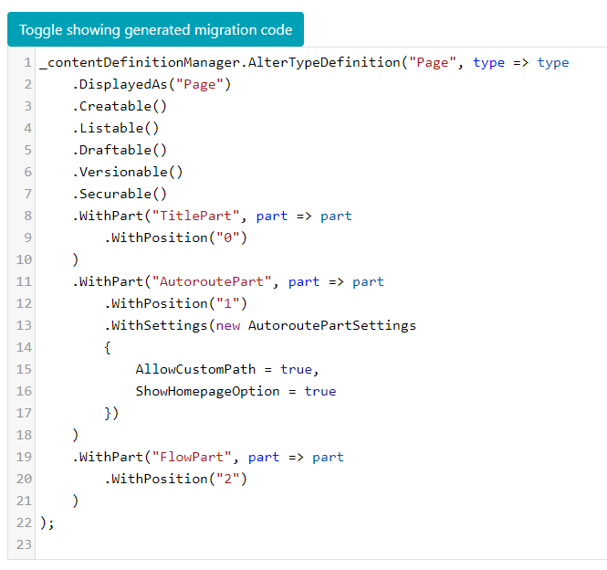
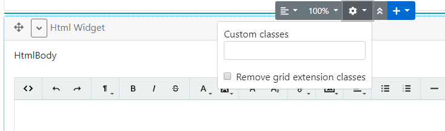

# Lombiq Helpful Extensions for Orchard Core


## About

Orchard Core module containing some handy extensions (e.g. useful content types and widgets). It's also available on all sites of [DotNest, the Orchard SaaS](https://dotnest.com/).

Do you want to quickly try out this project and see it in action? Check it out in our [Open-Source Orchard Core Extensions](https://github.com/Lombiq/Open-Source-Orchard-Core-Extensions) full Orchard Core solution and also see our other useful Orchard Core-related open-source projects!

Note that this module has an Orchard 1 version in the [dev-orchard-1 branch](https://github.com/Lombiq/Helpful-Extensions/tree/dev-orchard-1).


## Extensions

The module consists of the following independent extensions (all in their own features):

### Code Generation Helpful Extensions

#### Content definition code generation
Generates migration code from content definitions. You can use this to create (or edit) a content type on the admin and then move its creation to a migration class. Generated migration code is displayed under the content types' editors, just enable the feature. Check out [this demo video](https://www.youtube.com/watch?v=KOlsLaIzgm8) to see this in action.



### Flows Helpful Extensions

Adds additional styling capabilities to the OrchardCore.Flows feature by making it possible to add classes to widgets in the Flow Part editor. Just add `AdditionalStylingPart` to the content type using `FlowPart`.



### Helpful Widgets

Adds multiple helpful widget content types. These are basic widgets that are added by built-in Orchard Core recipes though in case of using a custom setup recipe these can be added by this feature too.

Includes:

- ContainerWidget: Works as a container for further widgets. It has a FlowPart attached to it so it can contain additional widgets as well.
- HtmlWidget: Adds HTML editing and displaying capabilities using a WYSIWYG editor. 
- LiquidWidget: Adds Liquid code editing and rendering capabilities.

### Helpful Content Types

Includes basic content types that are added by built-in Orchard Core recipes though in case of using a custom setup recipe these can be added by this feature too.

Includes:

- Page: Highly customizable page content type with FlowPart and AutoroutePart.

### Shape Tracing Helpful Extensions

Adds a dump of metadata to the output about every shape. This will help you understand how a shape is displayed and how you can override it. Just check out the HTML output. You can see a video demo of this feature in action [on YouTube](https://www.youtube.com/watch?v=WI4TEKVc9SA).

### Helpful Shapes

Adds common constructs you can use in your views.

#### BootstrapAccordion

It displays an [accordion powered by Bootstrap](https://getbootstrap.com/docs/4.0/components/collapse/#accordion-example). It displays shapes as content. The `Children` property is required.

```html
<shape type="BootstrapAccordion" 
       prop-AdditionalClasses="string" 
       prop-Children="IEnumerable<BootstrapAccordionItem>"></shape>
```

## Contributing and support

Bug reports, feature requests, comments, questions, code contributions, and love letters are warmly welcome, please do so via GitHub issues and pull requests. Please adhere to our [open-source guidelines](https://lombiq.com/open-source-guidelines) while doing so.

This project is developed by [Lombiq Technologies](https://lombiq.com/). Commercial-grade support is available through Lombiq.
